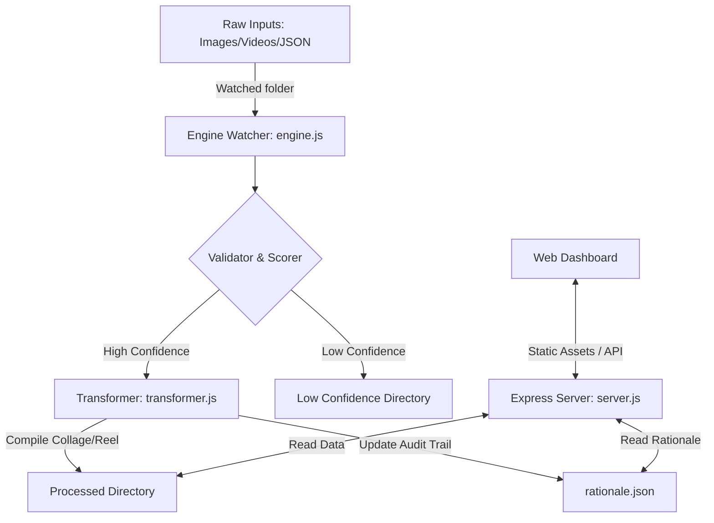

# Content & Design Engine Ecosystem

An automated, high-throughput pipeline designed to ingest raw social media files, validate and score text/media configurations, compile dynamic visual creatives, and serve an interactive management console.

---

## 🛠️ Architecture Overview

The ecosystem operates as a dual-component engine powered by a background-watching file processor and a web server running concurrently.



### 1. Watcher Pipeline (`engine.js`)
* **Watchdog System**: Monitors the `./input` directory using `chokidar` for real-time asset drops.
* **Pipeline Flow**:
  1. Detects dropped JSON files containing text configurations and asset file arrays.
  2. Hands text over to `services/scoring.js` for lexical and design-requirement analysis.
  3. Evaluates overall scoring:
     * **Score >= 0.7**: Deemed high-confidence, forwarded to `services/transformer.js`.
     * **Score < 0.7**: Moved directly to `./low-confidence` along with diagnostic logs.
  4. Triggers compilers to create ready-to-publish assets, archiving completed data into `./processed`.
  5. Updates a centralized audit trail (`rationale.json`) explaining processing decisions.

### 2. Quality Evaluation Service (`services/scoring.js`)
* Analyzes text formatting, hashtags, links, structural length, and grammatical quality.
* Checks matching alignments with media assets to ensure structural balance.
* Returns a computed confidence score between `0.0` and `1.0` with distinct rule checks.

### 3. Visual Compiler & Rendering Service (`services/transformer.js`)
* **LinkedIn Template Engine**: Leverages `sharp` to compile dynamically aligned image grids and collages matching the configurations inside `config.js` and target sizes.
* **Instagram Reel Engine**: Uses static `ffmpeg` binaries to stitch, crop (9:16 aspect ratio), and render optimized high-definition H.264 vertical video compilations.
* **Fallback Systems**: Automatically detects system binary permissions and provides graceful non-breaking mock fallbacks for video compilation.

### 4. Interactive Console & Dashboard (`server.js` & `web/index.html`)
* Hosts dynamic APIs mapping system data, audit trail logs, active process listings, and queue management.
* Offers a sleek, fully responsive playground with modern HSL palettes, dark mode styling, and dynamic performance counters.

---

## 📂 Project Directory Structure

```text
├── config.js               # Dynamic template and output size configurations
├── engine.js               # Pipeline watcher and flow processor
├── package.json            # Node dependencies and system scripts
├── run.js                  # Ecosystem initiator (performs setup, cleanups, runs server/watcher)
├── server.js               # REST API and web application server
├── services/
│   ├── scoring.js          # Text analysis, validation, and scoring module
│   └── transformer.js      # Visual compiler, Sharp grid generator, FFmpeg video renderer
├── templates/
│   └── linkedin/
│       ├── .gitkeep        # Git directory anchor
│       ├── manifest.json   # Template dimensions and configurations
│       └── professional-1.png # Template preview reference image
└── web/
    └── index.html          # Interactive control panel frontend dashboard
```

---

## 🚀 Getting Started

### Prerequisites
* [Node.js](https://nodejs.org/) (v16+ recommended)

### Installation
Clone the repository and install the standard dependencies:
```bash
npm install
```

### Running the Ecosystem
To run the full suite (the watchers, directories setup, database cleanup, and web dashboards concurrently):
```bash
node run.js
```
The console dashboard will be hosted at `http://localhost:3000`.

---

## 📊 Processing Guidelines

To feed the watch pipeline, drop a combined JSON configuration file alongside its named image/video assets into the `./input` folder.

#### JSON Input Format Example:
```json
{
  "id": "event-post-01",
  "platform": "linkedin",
  "text": "Join our dynamic panel mapping design innovation! #Design #Innovation",
  "assets": ["slide1.jpg", "slide2.jpg", "slide3.jpg"]
}
```
*Drop `slide1.jpg`, `slide2.jpg`, and `slide3.jpg` into the same directory before the JSON is saved to prevent pipeline gaps.*
