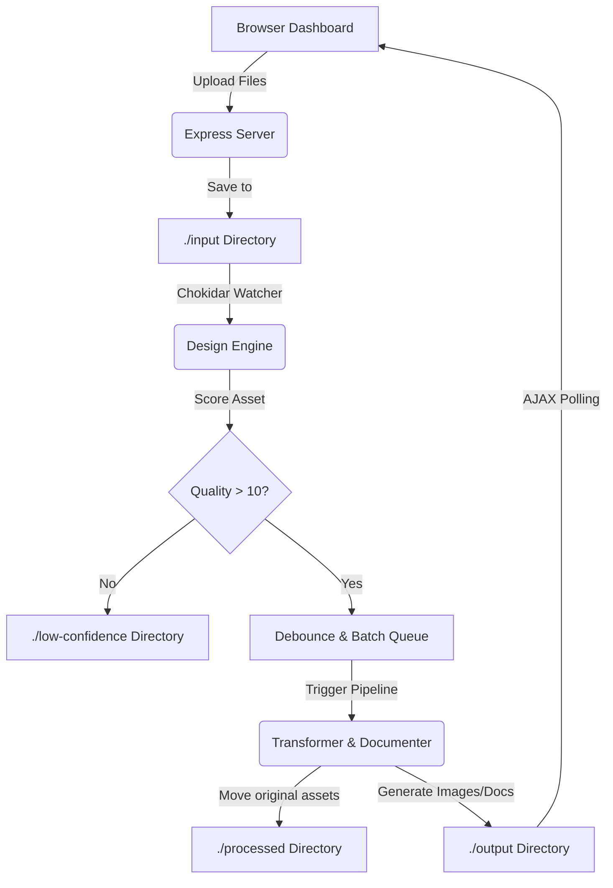

# Hackathon Solution Verification: Content & Design Engine

## 1. GitHub Repository
[https://github.com/aviraltrivedi/content-design-engine](https://github.com/aviraltrivedi/content-design-engine)

## 2. System Architecture



## 3. Input-to-Output Flow Verification

### Upload & Real-Time Scoring
Assets are uploaded directly via the interactive dashboard and appear in the `Live Scoring Pipeline` section as they are autonomously evaluated by the system.

*(Logs showing successful detection and scoring)*
```text
📄 New asset detected: 1777309397009-SUP_8294.JPG
✅ Quality approved. Queuing transformation...
📄 New asset detected: 1777309397410-SUP_8297.JPG
✅ Quality approved. Queuing transformation...
```

### Output Generation
After the debounce buffer collects the batch (e.g., 5 images), it triggers the transformation. The original assets are moved to `/processed` to prevent duplicates, and the final collages and Case Study files are generated in `/output` and displayed live on the dashboard.

## 4. Asset Selection Logic

The engine employs a real-time, threshold-based autonomous selection logic:
- **Detection**: Assets dropped into `./input` are immediately detected via file system events.
- **Scoring System**: Each asset is evaluated by calculating a composite `Quality Score` based on simulated metrics (contrast, sharpness, resolution, metadata).
- **Thresholding**: Assets scoring above the confidence threshold are approved for transformation.
- **Archival Routing**: Substandard assets are immediately rerouted to `./low-confidence/` for manual review, ensuring only high-quality assets enter the transformation pipeline.
- **Batch Processing**: Approved assets are queued using a 2.5-second debounce buffer and a concurrency lock. Once the batch is finalized, it is packaged together for dynamic layout construction.
